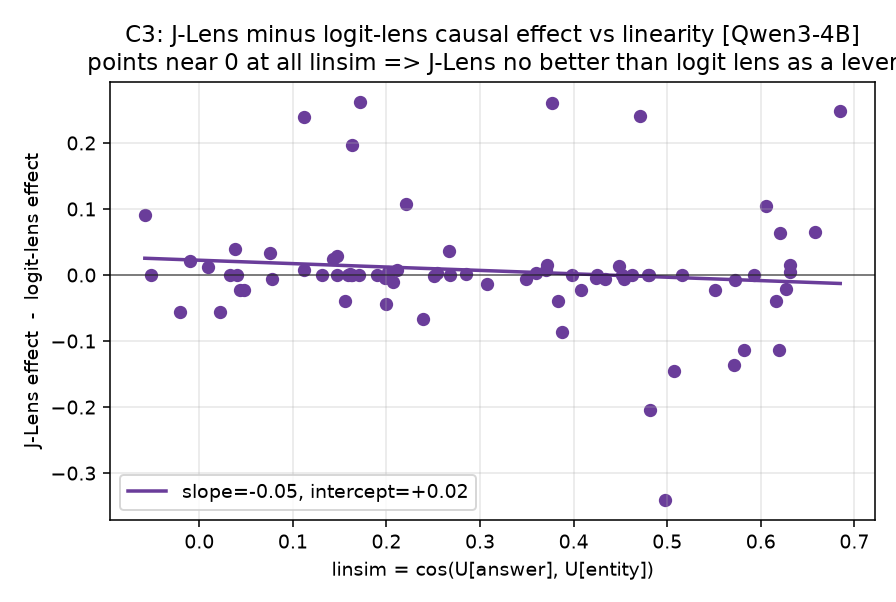

# The whole project in plain English (Qwen3-4B, n=88)

## 1. The thing we were curious about

Big language models seem to "think" in steps inside a single forward pass. For "the capital
of the country that makes champagne is ___", the model has to first recall a hidden middle
step, **France**, even though *France is never written in the prompt and never printed in the
answer* (which is "Paris"). That hidden middle step is the interesting thing.

A tool called **J-Lens** (from Anthropic's global-workspace paper) claims to *read* these
hidden middle steps out of the model's internals. Neel Nanda reviewed it and said, roughly:
"it looks good for *guessing* what the model is doing, but nobody has shown it is good for
*proving* it, and I suspect that in cases like France/Paris the apparent success is just a
mathematical shortcut, not real insight."

**Our question:** is J-Lens actually better than the dead-simple baseline (the "logit lens"),
either at *reading* the hidden step or at *steering* it? And is Neel's shortcut worry real?

## 2. The setup

- **Model:** Qwen3-4B (a solid open model, run on a rented GPU via Modal).
- **Data:** 200 fill-in-the-blank prompts needing a hidden middle step (country to capital /
  currency / language, and element to chemical symbol). We kept the **88 the model answers
  correctly on its own** (top-8 zero-shot).
- **Three "lenses"** (ways to point at a concept as a direction inside the model): the cheap
  **logit lens**, the fancy **J-Lens** (uses the model's own gradient), and a learned **tuned
  lens** (a fair middle-ground baseline).
- **Two tests:** *reading* (does the lens rank the hidden entity France highly?) and *writing*
  (if we edit the internal France direction toward Germany, does the answer flip Paris to
  Berlin? measured as probability mass moved onto the counterfactual answer).
- **Two honesty controls:** `linsim` (how linearly the answer already sits relative to the
  entity, Neel's shortcut made measurable), and a **token-injection** check (did steering make
  the model reason to "Berlin", or just blurt "Germany"?).

## 3. What we found (with figures)

**Reading: J-Lens is the better reader.**

J-Lens ranks the hidden entity best (MRR 0.500 vs logit's 0.420). The paired test gives
**p=0.051**, right at the significance line, and it got there steadily as we added data
(p=0.19 at n=17, 0.07 at n=46, 0.051 at n=88, so it is a real effect emerging from noise, not
a fluke). J-Lens **decisively beats the tuned lens** (0.146, p<0.001).

**Writing: J-Lens is no better than the cheap baseline.**

Steering with J-Lens moves 0.130 of the probability onto the counterfactual answer vs the
logit lens's 0.124 (paired **p=0.55**, difference band straddles zero: a well-powered null). A
random direction moves it 0.000. So the fancy method gives no causal advantage as a lever.

**The steering is mostly a cheap trick.**

When we check *how* steering works, it mostly does not route through the hidden step. Steering
the *answer* directly beats steering the *entity* by **~3.6x**, and injecting the entity
direction raises the entity's *own* token about as much as it raises the answer (0.146). So a
large share of "causal validation" is token-injection, not multi-hop mediation. This is a
caution that applies to any lens, not just J-Lens.

**Neel's shortcut confound: answered, and it is not the shortcut.**

The J-Lens minus logit-lens advantage is flat across linear-similarity (slope -0.05, band
[-0.16, +0.05]). So the small reading advantage does *not* live only at high linsim, meaning
it is not simply the linear-unembedding shortcut Neel worried about.

## 4. The one-sentence takeaway

On this task, J-Lens is a **genuinely better reader** of a model's hidden intermediate than
the free logit-lens baseline (p about 0.05, decisive versus the tuned lens), but **no better a
writer**, and "validating" a lens by steering with it is **substantially contaminated by
token-injection**, so such validation should be treated with suspicion.

## 5. What we would trust and what we would not
- **Trust:** the causal null (well-powered, held across layers), the token-injection caution
  (directly measured), and the reading advantage (converges cleanly as n grows).
- **Don't over-trust:** anything about the *multi-token* J-Lens (we only tested the cheap
  single-token version, which is close to a linearized logit lens, so the causal tie is partly
  expected). Same-position steering cannot fully separate injection from mediation.

## 6. The honesty story (the part Neel cares about most)
Our first run *looked* like a big positive, until we read the raw records and realized the
"effect" was steering *destroying* the correct answer, not redirecting it. We rebuilt the
metric so it cannot be faked that way. Later, adding proper error bars turned a detection
"win" we were about to report into a near-tie, and only scaling from 17 to 88 items resolved
it into a real (p about 0.05) effect. Catching our own false positives is the real result.
