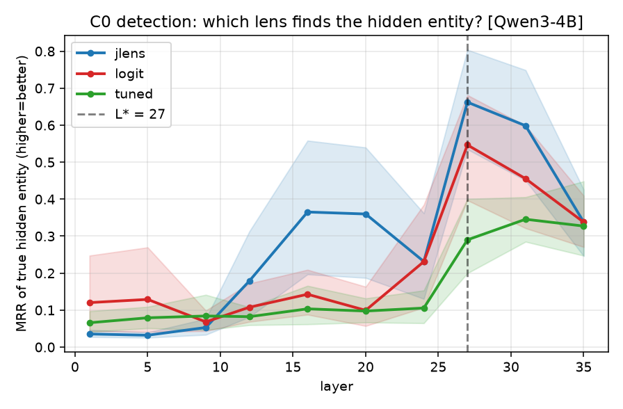
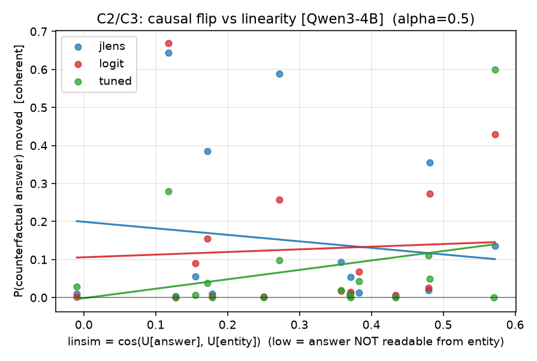
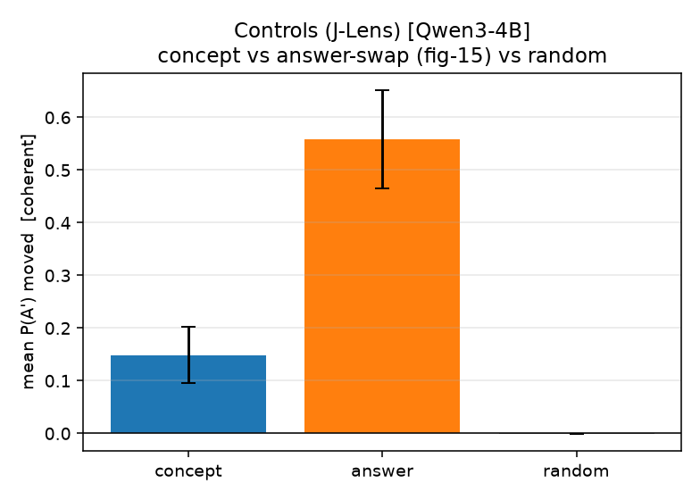
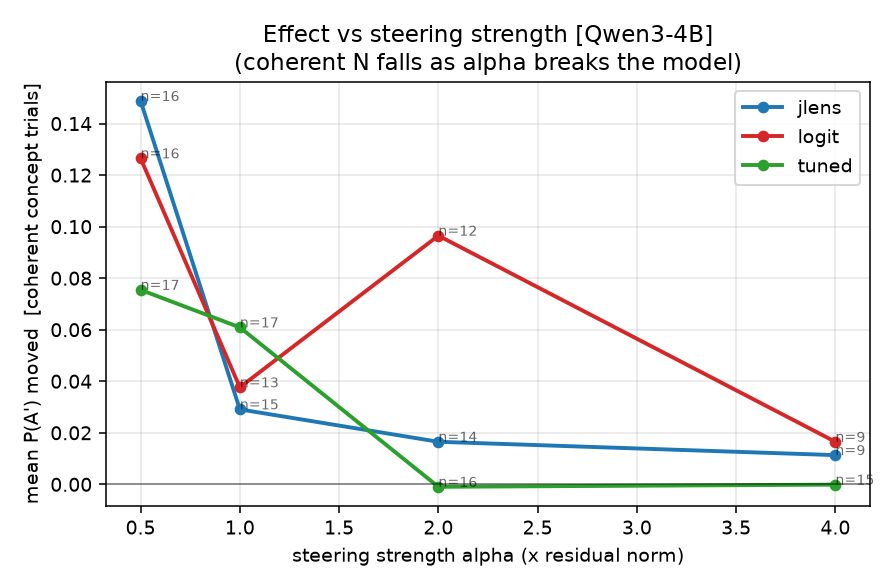

# The whole project in plain English

## 1. The thing we were curious about

Big language models seem to "think" in steps inside a single forward pass. For "the capital
of the country that makes champagne is ___", the model has to first recall a hidden middle
step — **France** — even though *France is never written in the prompt and never printed in
the answer* (which is "Paris"). That hidden middle step is the interesting thing.

There's a new tool called **J-Lens** that claims to *read* these hidden middle steps out of
the model's internals. Neel Nanda (the person we're applying to) reviewed the J-Lens paper
and said, roughly: "it looks good for *guessing* what the model is doing, but nobody has shown
it's good for *proving* it — and I have a specific worry that in cases like France/Paris the
apparent success is just a mathematical shortcut, not real insight."

**Our question:** is J-Lens actually better than the dead-simple baseline (the "logit lens"),
either at *reading* the hidden step or at *pushing on it*? And is Neel's shortcut worry real?

## 2. The setup

- **Model:** Qwen3-4B (a solid open model, run on a rented GPU via Modal).
- **Data:** 24 fill-in-the-blank prompts where the answer requires a hidden middle step
  (country->capital, country->currency, element->chemical-symbol). We kept the 17 the model
  answers correctly on its own.
- **Three "lenses" (ways to point at a concept as a direction inside the model):**
  1. **logit lens** — the cheap baseline. Ignores most of the network.
  2. **J-Lens** — the fancy new one. Uses the model's own gradient (how much "thinking about
     France more" would change the output).
  3. **tuned lens** — a learned middle-ground baseline, so the comparison is fair.
- **Two tests:**
  - **Reading (detection):** at each layer, does the lens correctly point at the hidden
    entity (France) out of a list of candidates? Score = how highly it ranks the right one.
  - **Writing (steering):** if we *edit* the model's internal "France" direction toward
    "Germany", does the final answer flip from Paris to Berlin? We measure how much
    probability actually moves onto the counterfactual answer.
- **The key control (Neel's worry, made measurable):** for each item we measure `linsim` =
  how linearly related the answer already is to the entity. If a lens only "works" when
  linsim is high, it's exploiting the shortcut, not doing real work.
- **A second key control:** when we push "France->Germany", does the answer become "Berlin"
  (real multi-step reasoning), or does the model just start saying "Germany" (a cheap trick
  we call *token-injection*)? The two-hop design lets us tell these apart.

## 3. What we found (with the honesty checks)

**Reading:** J-Lens scored highest (0.66) but logit lens was close behind (0.55), and once we
put proper error bars on it, **the difference is inside the noise** (paired test p=0.19; the
confidence bands overlap — see fig1 above). J-Lens clearly beat the tuned lens, but the tuned lens
is trained for a different job and is a weak detector here, so that's not strong evidence. So:
J-Lens is numerically the best reader, but we can't claim it's *significantly* better than the
free baseline at this sample size.

**Writing:** J-Lens and logit lens are **tied** as steering tools (0.149 vs 0.127, p=0.50 —
see fig2 above). The fancy method gives no causal advantage over the cheap one.

**The interesting bit — most "steering validation" is a cheap trick.** When we looked at
whether steering actually routed through the hidden step, it mostly didn't. Directly pushing
the *answer* worked several times harder than pushing the *entity* (fig4), and pushing the
entity mostly just made the model say the entity's own name. In 5 randomly chosen examples,
4 were mostly token-injection and only 1 (Italy->Greece giving Rome->Athens cleanly) was
genuine reasoning. This matters beyond J-Lens: it's a caution about how people "prove" any
interpretability tool works by steering with it.

**Neel's shortcut confound:** we couldn't settle it — not enough low-linsim data survived the
model's own competence filter, so the answer is "unrefuted, not resolved" (fig3, wide error bar).

(fig5: the steering effect only exists at the gentlest strength and dies as stronger edits
break the model — which is why the headline uses the gentlest setting.)

## 4. The one-sentence takeaway

On this task and scale, the fancy J-Lens gives **no statistically significant advantage over
the free logit-lens baseline** as either a reader or a writer, and "validating" a lens by
steering with it is **substantially contaminated by token-injection** — so such validation
should be treated with suspicion.

## 5. What we'd trust and what we wouldn't
- **Trust:** the causal null (J-Lens ~ logit lens as a lever) — it held across two layers and
  has a proper test. The token-injection caution — it's directly measured.
- **Don't over-trust:** the reading comparison (underpowered, n=17), the confound test
  (inconclusive), and anything about the *multi-token* J-Lens (we only tested the cheap
  single-token version, which is expected to behave a lot like logit lens).

## 6. The honesty story (the part Neel cares about most)
Our first run *looked* like a big positive — until we read the raw numbers and realized the
"effect" was the steering *destroying* the correct answer, not redirecting it. We rebuilt the
metric so it can't be faked that way. Later, adding proper error bars turned a detection "win"
we were about to report into a statistical tie. Catching our own false positives twice is the
real result here.
