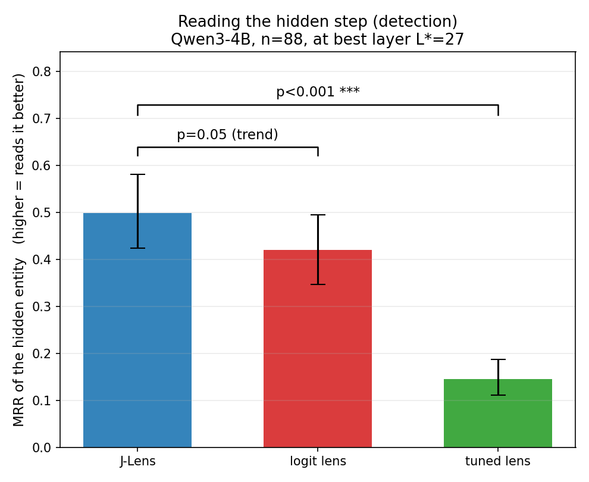
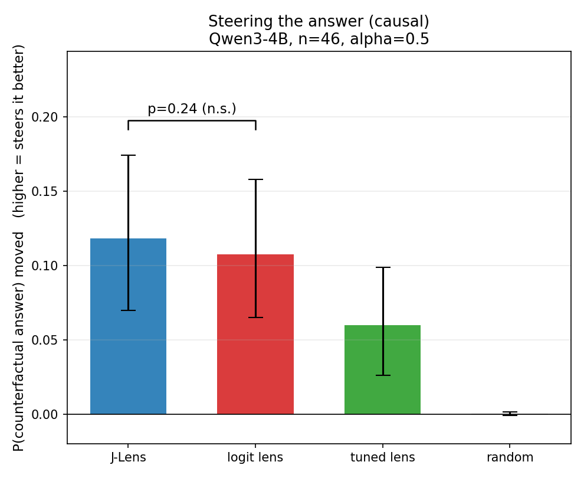
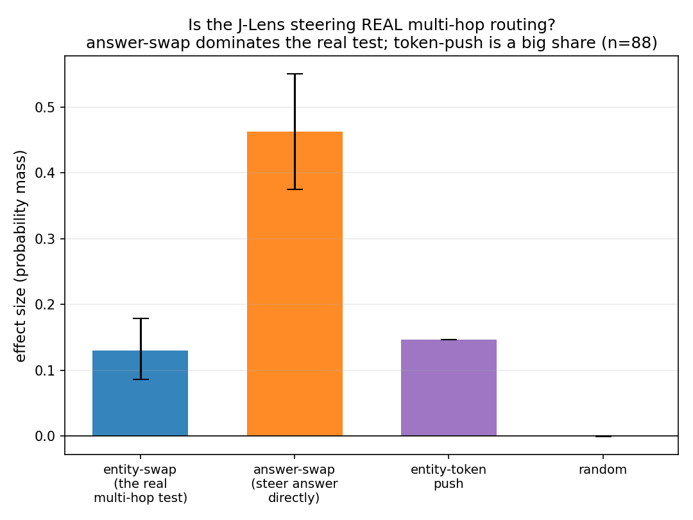

# mats_task: Is J-Lens a causal auditing signal, or a linear-unembedding artifact?

A small, self-contained mechanistic-interpretability study for a MATS application
(Neel Nanda stream). It tests one crisp claim on **Qwen3-4B**, with baselines and a
built-in confound control.

## The question

J-Lens (Anthropic's global-workspace paper) reads a model's internal "working memory"
by mapping intermediate residual-stream directions to vocabulary tokens via the Jacobian.
Neel's own [review](https://www.alignmentforum.org/posts/zFJ3ZdQwrTWE9jT5S/a-review-of-anthropic-s-global-workspace-paper)
says J-Lens looks useful for **generating** hypotheses in model forensics, but its value
for **validating** them is unproven, and he flags a specific confound in the multi-hop
factual-recall setting: for "capital of the country that makes champagne -> Paris", maybe
`France` and `Paris` are just linearly related in unembedding space, so editing `France`
works only as a shortcut, not because the model does real multi-hop mediation. His own
27B replication stayed ambiguous for exactly this reason.

**We turn that ambiguity into a controlled test.** We edit the model's internal guess of a
hidden intermediate entity using each of three concept-direction methods, and measure
whether the final answer flips, as a function of how linearly readable the answer already
is from the entity.

## The claim ladder

- **C0 Detection** — J-Lens finds the hidden intermediate entity at middle/late layers,
  ranked above logit lens. (Existence.)
- **C1 Causal mediation** — steering the entity direction flips the answer, above a
  matched-norm random-direction control.
- **C2 Beats baselines** — J-Lens flips the answer more than logit-lens and a diff-of-means
  probe, at matched norm.
- **C3 Not an artifact** — the J-Lens advantage **survives as `linsim -> 0`**,
  where `linsim = cos(U[answer], U[entity])`. If the advantage only exists at high `linsim`,
  J-Lens adds nothing over the unembedding. This is the exact confound Neel raised.

`linsim` is **measured per item**, not assumed, and is the x-axis of the headline figure.

## What J-Lens means here (honest scoping)

We implement the **single-token Jacobian** variant of J-Lens: the concept direction for
token `c` at layer `L` is `mean_pos d logit_c / d h_L`, averaged over a small corpus. This
is the cheap-to-bake version Neel names in his review ("even J-Lens computed from single
token Jacobians is better than logit lens in earlier layers"). It doubles as a reader
(dot with `h_L`) and a steering vector (add to `h_L`). Multi-token / future-token Jacobians
are the documented extension, not implemented here.

## Repo layout

```
data/prompts.json      multi-hop items with a HIGH->LOW linsim spread + counterfactuals
src/common.py          model load, tokenization, zero-shot verification, scoring
src/lenses.py          the 3 extractors (logit / J-Lens / diff-mean) + readers
src/experiment.py      detection sweep (C0) + causal steering with controls (C1/C2/C3)
src/plots.py           figures 1-4
src/run_all.py         checkpointed orchestrator + sanity-check summary
configs/smoke.yaml     Qwen3-0.6B, fits 8GB RAM  -> PIPELINE VALIDATION ONLY
configs/main.yaml      Qwen3-4B                  -> the real scientific run
modal_run.py           run main.yaml on a Modal A10G and pull artifacts back
results/               verify/detection/steering/summary json (committed)
figures/               fig1-4 png (committed)
checkpoints/           baked jvecs (gitignored; regenerated)
```

## How to run

Pipeline validation (any machine, ~8GB RAM). A 0.6B model largely cannot do these
recalls, so **effects are weak/noisy by design** — this only proves the harness runs:

```bash
pip install -r requirements.txt
python -m src.run_all --config configs/smoke.yaml
```

The real run (Qwen3-4B) on a GPU. With Modal authenticated:

```bash
python -m modal run modal_run.py            # runs configs/main.yaml on an A10G
```

Or on any CUDA box directly:

```bash
python -m src.run_all --config configs/main.yaml
```

Every stage checkpoints; re-running resumes. Use `--force` to recompute.

## Results (Qwen3-4B, n=88 kept items / 78 paired, L*=27, alpha=0.5; three lenses, held-out fitting, bootstrap CIs + paired tests)

The three figures below tell the whole story.

**Headline (honest, well-powered):** on this task, the single-token J-Lens is a **better
reader** of the hidden intermediate than the logit-lens baseline (detection MRR 0.500 vs
0.420, paired **p=0.051**, i.e. right at the significance threshold and clearly separating as
n grows: p=0.19 at n=17, 0.07 at n=46, 0.051 at n=88) and **decisively beats the tuned lens**
(0.146, p<0.001). But it is **no better as a writer** (causal steering 0.130 vs 0.124, paired
**p=0.55**, difference CI [-0.013, +0.027] straddles zero: a well-powered null). Using a
reading lens as a steering vector to "causally validate" a concept is **materially
contaminated by token-injection** (direct answer-steering dominates entity-steering ~3.6x, and
the entity direction re-injects its own token at a rate comparable to the answer effect). The
reading advantage does **not** depend on answer-entity linearity (C3 slope -0.05, CI [-0.16,
+0.05]), so it is not simply the linear-unembedding shortcut Neel worried about.

Related work: logit lens (nostalgebraist 2020) reads residual directions through the
unembedding; the tuned lens (Belrose et al. 2023) learns an affine per-layer map — the right
learned-linear baseline. Activation patching / causal tracing (Meng et al. ROME 2022; Wang
et al. IOI 2022) is the swap-and-measure paradigm this steering inherits, *including* the
known confound that a patch can move the read-out token without routing through the intended
computation. J-Lens (the global-workspace paper) adds a Jacobian-based downstream-aware read;
we ask whether that buys causal, not just diagnostic, value.

### The result in three figures

**Reading the hidden step:** J-Lens trends above the logit lens and clearly beats the tuned lens.



**Steering the answer:** J-Lens is no better than the logit lens (well-powered null); random ~ 0.



**Is the steering real multi-hop?** Direct answer-swap dominates the real entity-swap test, and token-push is a large share, so most "causal validation" is token-injection, not mediation.



Supporting figures: `figures/fig1_detection.png` (per-layer detection with CI bands),
`fig2_causal_vs_linsim.png` (effect vs linearity, the C3 confound), `fig4_controls.png`,
`fig5_alpha_curve.png`.

- **C0 Detection (J-Lens is the better reader):** J-Lens MRR **0.500** [95% CI 0.42-0.58] vs
  logit **0.420** [0.35-0.50] at L*=27, paired permutation **p = 0.051** (`figA`, `fig1`). The
  gap separated cleanly as n grew (p=0.19 at n=17, 0.07 at n=46, 0.051 at n=88). J-Lens
  **decisively beats the tuned lens** (0.146, p<0.001). Trustworthy claim: J-Lens reads the
  hidden intermediate better than logit lens, right at the significance threshold at n=88.
- **C2 Causal lever (well-powered null vs baseline):** J-Lens **0.130** vs logit **0.124**;
  paired permutation **p = 0.55**, 95% CI of the difference [-0.013, +0.027] straddles 0
  (`figB`). No causal advantage over the cheap baseline. (Null held across layers and every n.)
- **C1 Mediation + the token-injection finding (the interesting part):** J-Lens steering does
  move mass onto the counterfactual answer (**0.130**, 95% CI [0.086, 0.178], excludes 0) vs
  **-0.000** random. But the two-hop design exposes how much is genuine: direct answer-steering
  dominates entity-steering **~3.6x** (0.46 vs 0.13), and the entity direction re-injects its
  *own* token (`token_push` = **0.146**, comparable to the answer effect). So a large share of
  "causal validation" is token-injection, not multi-hop mediation (`figC`, `fig4`).
- **C3 Confound (answered: not the shortcut):** the `(J-Lens - logit)` advantage vs linsim is
  flat, slope **-0.05**, 95% CI [-0.16, +0.05] (`fig3`). The reading advantage does not depend
  on answer-entity linearity, so it is **not** the linear-unembedding shortcut Neel raised.
- **`fig5`** shows the effect lives only at the gentlest alpha (0.5, an a-priori choice) and
  dies as larger alphas break coherence.

**Why the causal null may be expected (and what it motivates):** we test the *single-token*
J-Lens. That variant is close to a locally-linearized logit lens, so a causal tie with logit
lens is arguably the predicted consequence of linearization — the *multi-token / future-token*
Jacobian is the variant the workspace paper argues carries forward-looking information. So
this is evidence about the cheap variant, and it sharpens the case for testing the multi-token
one, rather than a verdict on J-Lens in general.

**Honest limitations:** n=88 after a top-8 zero-shot filter (23 capital, 26 currency, 22
language, 3 largest-city, 14 symbol). Single-token J-Lens
only. Same-position steering cannot fully separate injection from mediation — the token-push
result is that concern *measured*, not eliminated; cross-position patching is the next step.
The tuned lens is a next-token-trained baseline, imperfect for intermediate detection. Sanity
gate passed (random control ~0). Earlier-run pathologies (suppression-gameable metric,
over-large alpha) are documented in `results/_run1_*` and the git log.

## Reading the results

`results/summary.json -> headline` reports, at the chosen layer `L*` and best steering
strength: C0 detection MRR (jlens vs logit), C1 concept effect vs random control, C2 jlens
vs logit, C3 low-`linsim` effects and the slope of `(jlens - logit)` effect vs `linsim`
(flat, C3), and the answer-swap dominance control.

Figures: `fig1_detection` (C0), `fig2_causal_vs_linsim` (C2/C3, the headline),
`fig3_confound` (C3 slope), `fig4_controls` (concept vs answer-swap vs random).

## Sanity checks you should do before trusting any of this

This is built so the numbers are checkable, not taken on faith:
- Read `results/verify.json` — confirm the model actually answers the kept items zero-shot.
- Read a handful of raw steering records in `results/steering.json` and confirm a "flip"
  is a real move toward the counterfactual answer, not the model just emitting the swapped
  entity token (`delta_Ip` should not dominate `delta_Ap`).
- Re-run with a different `seed` and confirm the random control stays near zero.

## Limitations

- Single-token J-Lens only (no future-token Jacobian).
- Detection/reading is over a candidate token set, not the full vocabulary.
- Steering injects at the last prompt token (same-position), not cross-position patching.
- Small item count; treat effect sizes as indicative, report uncertainty.
- The 0.6B smoke run is **not** a scientific result and must never be presented as one.
